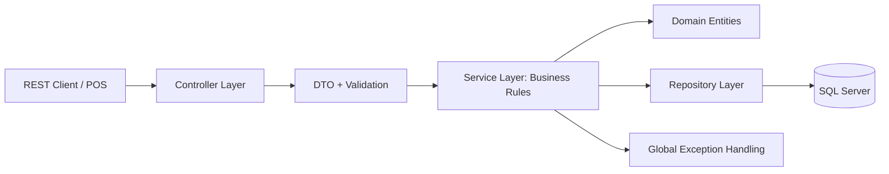
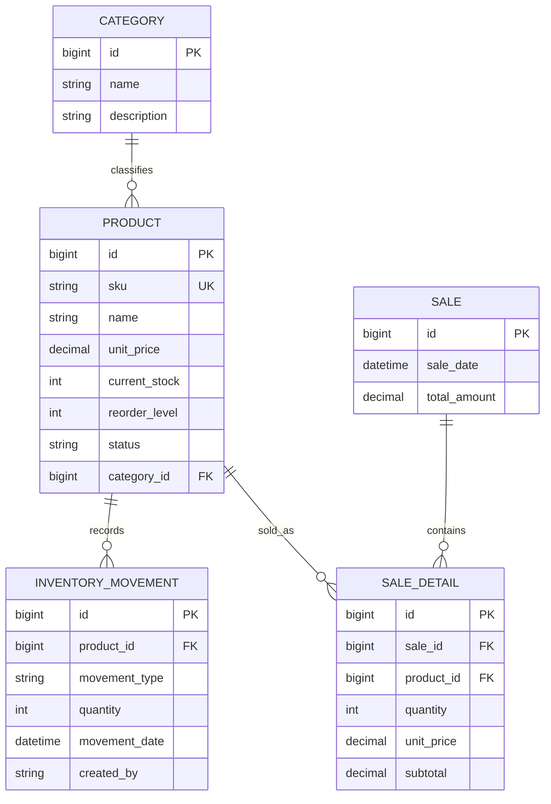
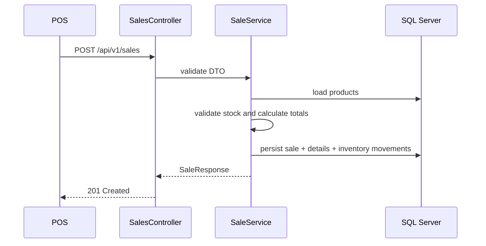

# Mermaid Diagrams

## Clean Architecture

```mermaid
flowchart LR
Client[REST Client / POS] --> Controller[Controller Layer]
Controller --> DTO[DTO + Validation]
DTO --> Service[Service Layer: Business Rules]
Service --> Domain[Domain Entities]
Service --> Repository[Repository Layer]
Repository --> DB[(SQL Server)]
Service --> Exceptions[Global Exception Handling]
```

## ER Diagram

```mermaid
erDiagram
  CATEGORY ||--o{ PRODUCT : classifies
  PRODUCT ||--o{ INVENTORY_MOVEMENT : records
  SALE ||--o{ SALE_DETAIL : contains
  PRODUCT ||--o{ SALE_DETAIL : sold_as
  CATEGORY { bigint id PK string name string description }
  PRODUCT { bigint id PK string sku UK string name decimal unit_price int current_stock int reorder_level string status bigint category_id FK }
  INVENTORY_MOVEMENT { bigint id PK bigint product_id FK string movement_type int quantity datetime movement_date string created_by }
  SALE { bigint id PK datetime sale_date decimal total_amount }
  SALE_DETAIL { bigint id PK bigint sale_id FK bigint product_id FK int quantity decimal unit_price decimal subtotal }
```

## Sale Transaction

```mermaid
sequenceDiagram
  participant POS
  participant API as SalesController
  participant SVC as SaleService
  participant DB as SQL Server
  POS->>API: POST /api/v1/sales
  API->>SVC: validate DTO
  SVC->>DB: load products
  SVC->>SVC: validate stock and calculate totals
  SVC->>DB: persist sale + details + inventory movements
  SVC-->>API: SaleResponse
  API-->>POS: 201 Created
```
